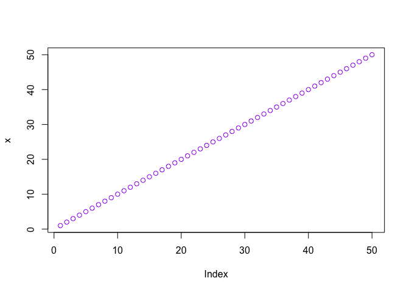
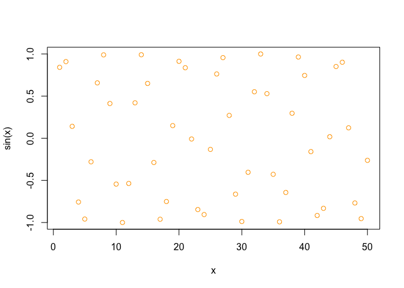
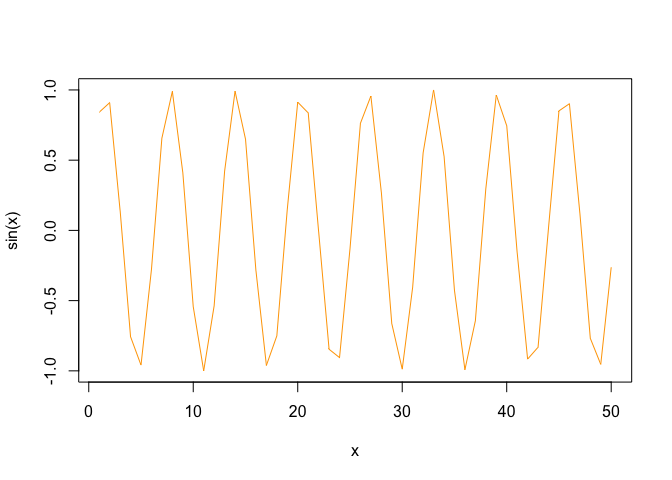
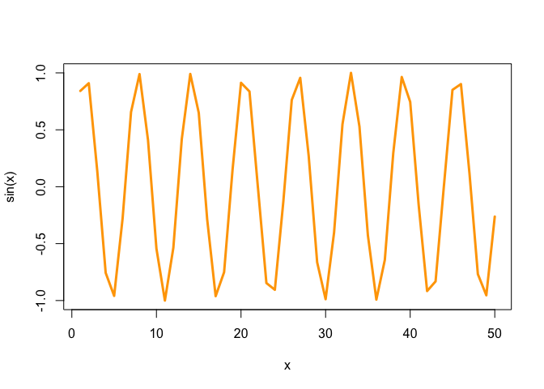

# Class 4 Lab
Xiaohe Li (PID 16354124)
Invalid Date

``` r
# This is my first R script
x <- 1:50
plot(x)
```


``` r
plot(x, col='purple')
```



``` r
plot(x, sin(x), col='orange')
```



``` r
plot(x, sin(x), col='orange', type='l')
```



``` r
plot(x, sin(x), col='orange', type='l', lwd=3)
```



``` r
log(10)
```

    [1] 2.302585

``` r
log10(10)
```

    [1] 1

``` r
log(10, base=exp(1))
```

    [1] 2.302585
