# Class 7: Maching Learning I
Henry Li (PID: 16354124)

Today we begin our exploration of some “classical” machine learning
approaches. We will start with clustering:

Let’s first make up some data to cluster where we know what the answer
should be.

``` r
# rnorm() generates random numbers from a normal distribution
# Arguments: mean, sd, n
# Required arguments: n (mean = 0, sd = 1)
hist(rnorm(114514))
```

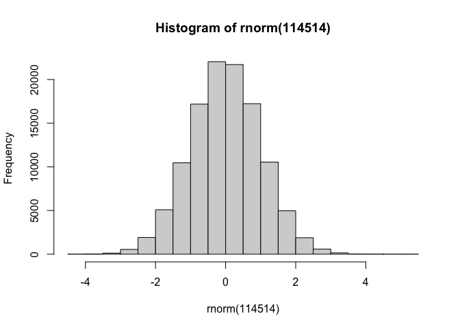

``` r
x <-  c(rnorm(100, -3, 1), rnorm(200, 2, 1))
hist(x)
```

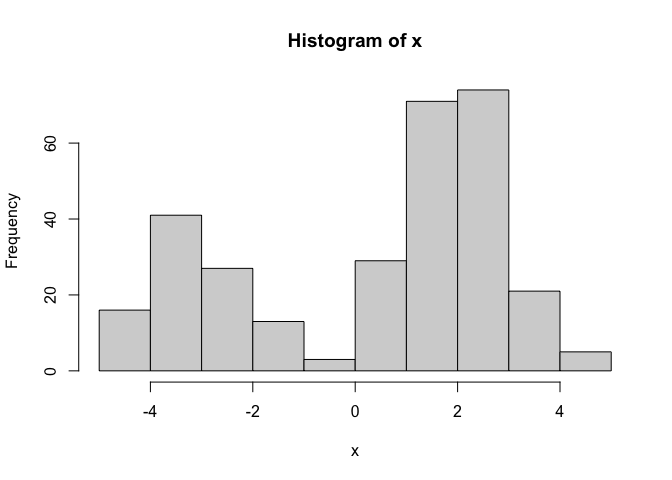

``` r
# rev() reverses the order of a vector
y <- rev(x)
b <- cbind(x,y)
head(b)
```

                  x        y
    [1,] -2.7585964 3.452342
    [2,] -1.3930780 2.444830
    [3,] -4.3551183 3.612634
    [4,] -0.9604109 3.497961
    [5,] -4.9166986 2.310144
    [6,] -3.5553736 1.615657

``` r
tail(b)
```

                  x          y
    [295,] 1.615657 -3.5553736
    [296,] 2.310144 -4.9166986
    [297,] 3.497961 -0.9604109
    [298,] 3.612634 -4.3551183
    [299,] 2.444830 -1.3930780
    [300,] 3.452342 -2.7585964

A peek at a few rows of the data:

``` r
plot(b)
```

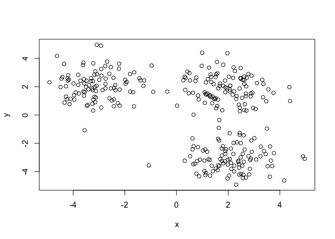

The main function in “base” R for K-means clustering is called
`kmeans()`.

``` r
kmeans(b, centers = 2)
```

    K-means clustering with 2 clusters of sizes 108, 192

    Cluster means:
               x         y
    1  2.1801865 -2.746717
    2 -0.6985139  2.072869

    Clustering vector:
      [1] 2 2 2 2 2 2 2 2 2 2 2 2 2 2 2 2 2 2 2 2 2 2 2 2 2 2 2 2 2 2 2 2 2 2 2 2 2
     [38] 2 2 2 2 2 2 2 2 2 2 2 2 2 2 2 2 2 2 2 2 2 2 2 2 2 2 2 2 2 2 2 2 2 2 2 2 2
     [75] 2 2 2 2 2 2 2 2 2 2 2 2 2 2 2 2 2 2 2 2 2 2 2 2 2 2 2 2 2 2 2 2 2 2 1 2 2
    [112] 2 2 2 2 1 2 2 2 2 2 2 2 2 2 2 2 2 2 2 2 2 2 2 2 2 2 2 2 1 2 2 2 2 2 1 2 2
    [149] 2 2 2 2 2 2 2 2 2 2 2 2 2 2 2 2 2 2 2 2 2 1 2 1 2 2 2 1 2 2 2 2 2 2 2 2 2
    [186] 1 2 2 2 2 2 2 2 2 2 2 2 2 1 2 1 1 1 1 1 1 1 1 1 1 1 1 1 1 1 1 1 1 1 1 1 1
    [223] 1 1 1 1 1 1 1 1 1 1 1 1 1 1 1 1 1 1 1 1 1 1 1 1 1 1 1 1 1 1 1 1 1 1 1 1 1
    [260] 1 1 1 1 1 1 1 1 1 1 1 1 1 1 1 1 1 1 1 1 1 1 1 1 1 1 1 1 1 1 1 1 2 1 1 1 1
    [297] 1 1 1 1

    Within cluster sum of squares by cluster:
    [1]  301.2125 1450.8874
     (between_SS / total_SS =  55.4 %)

    Available components:

    [1] "cluster"      "centers"      "totss"        "withinss"     "tot.withinss"
    [6] "betweenss"    "size"         "iter"         "ifault"      

> Q. How big are the clusters (i.e. their sizes)?

``` r
k <- kmeans(b, centers = 3)
k$size
```

    [1] 104  98  98

> Q. What clusters do my data point resides in

``` r
k$cluster
```

      [1] 3 3 3 3 3 3 3 3 1 3 3 3 3 3 3 3 3 3 3 3 3 3 3 3 3 3 3 3 3 3 3 3 3 3 3 3 3
     [38] 3 3 3 3 3 3 3 3 3 3 3 3 3 3 3 3 3 3 3 3 3 3 3 3 3 3 3 3 3 3 3 3 3 3 3 3 3
     [75] 3 3 3 3 3 3 3 3 3 3 3 3 1 3 3 3 3 3 3 3 3 3 3 3 3 3 1 1 1 1 1 1 1 1 1 1 1
    [112] 1 1 1 1 1 1 1 1 1 1 1 1 1 1 1 1 1 1 1 1 1 1 1 1 1 1 1 1 1 1 1 1 1 1 1 1 1
    [149] 1 1 1 1 1 1 1 1 1 1 1 1 1 1 1 1 1 1 1 1 1 1 1 1 1 1 1 1 1 1 1 1 1 1 1 1 1
    [186] 1 1 1 1 1 1 1 1 1 1 1 1 1 1 1 2 2 2 2 2 2 2 2 2 2 2 2 2 1 2 2 2 2 2 2 2 2
    [223] 2 2 2 2 2 2 2 2 2 2 2 2 2 2 2 2 2 2 2 2 2 2 2 2 2 2 2 2 2 2 2 2 2 2 2 2 2
    [260] 2 2 2 2 2 2 2 2 2 2 2 2 2 2 2 2 2 2 2 2 2 2 2 2 2 2 2 2 2 2 2 2 1 2 2 2 2
    [297] 2 2 2 2

> Q. Make a plot of our data colored by cluster assignment - i.e. Make a
> result figure.

``` r
# Assign cluster 1 cyan, cluster 2 violet, cluster 3 red
plot(b, col = c("cyan", "violet", "red")[k$cluster], pch = 19)
points(k$centers, col = c("purple", "red", "blue"), pch = 8, cex = 2)
```

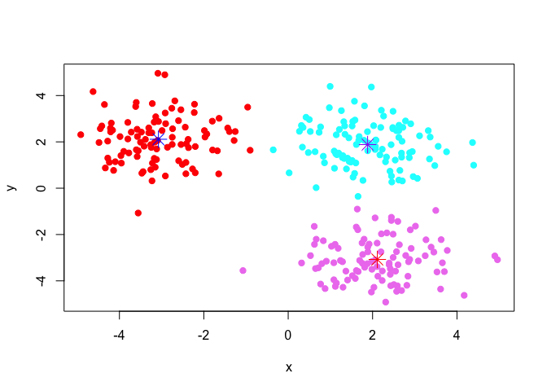

> Q. How about asking for more clusters?

``` r
k <- kmeans(b, centers = 5)
plot(b, col = c("cyan", "violet", "red", "green", "orange")[k$cluster], pch = 19)
points(k$centers, col = c("purple", "red", "blue", "black", "yellow"), pch = 8, cex = 2)
```

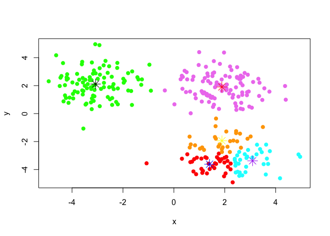

> Q. Run kmeans with centers (i.e. values of k) equal 1 to 6, and store
> the tot.withinss.

``` r
getSS <- function(k) {
  km <- kmeans(b, centers = k)
  return(km$tot.withinss)
}
ss <- sapply(1:6, getSS)
# ss is a vector of tot.within, it stands for "total within-cluster sum of squares", which symbolizes how tightly the data points in each cluster are grouped together. The larger ss is, the more dispersed the clusters are.
plot(ss, typ='b')
```

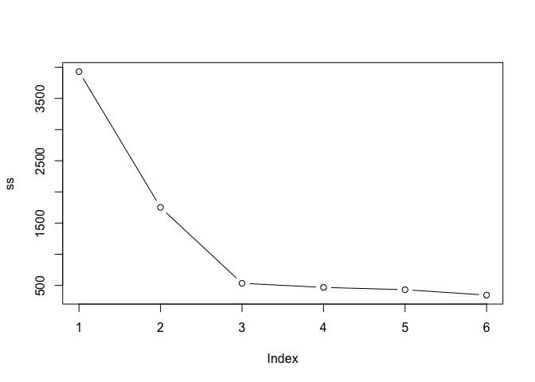

## Hierarchical Clustering

The main function in “base” R for this is called `hclust()`.

``` r
# The argumetn to hclust(), d, is a distance matrix, which can be generated by the dist() function. dist() computes and returns the distance matrix computed by using the specified distance measure to compute the distances between the rows of a data matrix.
d <- dist(b)
hc <- hclust(d)
hc
```


    Call:
    hclust(d = d)

    Cluster method   : complete 
    Distance         : euclidean 
    Number of objects: 300 

``` r
#Dendrogram
plot(hc)
abline(h = 8, col = "red")
```

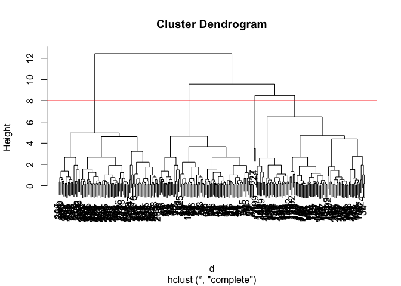

To obtain clusters from our `hclust` result object **hc**, we “cut” the
tree to yield different sub-branches. For this, we use the `cutree()`
function.

``` r
# 1. Cut by desired cluster number
grps1 <- cutree(hc, k = 3)
plot(b, col = c("cyan", "violet", "red")[grps1], pch = 19)
```

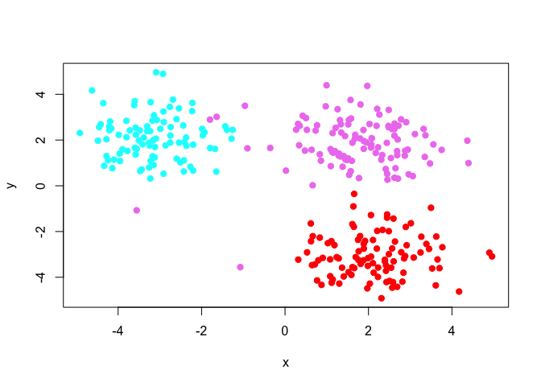

``` r
# 2. Cut by desired height
grps2 <- cutree(hc, h =10)
plot(b, col = c("cyan", "violet", "red")[grps2], pch = 19)
```

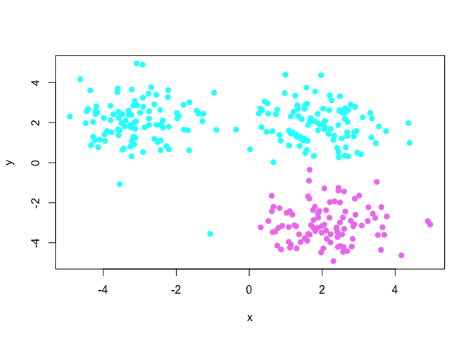

## Principal Component Analysis (PCA)

> Q1. How many rows and columns are in your new data frame named x? What
> R functions could you use to answer this questions?

``` r
# Import data
url <- "https://tinyurl.com/UK-foods"
x <- read.csv(url)
dim(x)
```

    [1] 17  5

``` r
head(x)
```

                   X England Wales Scotland N.Ireland
    1         Cheese     105   103      103        66
    2  Carcass_meat      245   227      242       267
    3    Other_meat      685   803      750       586
    4           Fish     147   160      122        93
    5 Fats_and_oils      193   235      184       209
    6         Sugars     156   175      147       139

Set the rownames() to the first column and then removes the troublesome
first column (with the -1 column index)

``` r
# Note how the minus indexing works
rownames(x) <- x[,1]
x <- x[,-1]
head(x)
```

                   England Wales Scotland N.Ireland
    Cheese             105   103      103        66
    Carcass_meat       245   227      242       267
    Other_meat         685   803      750       586
    Fish               147   160      122        93
    Fats_and_oils      193   235      184       209
    Sugars             156   175      147       139

``` r
dim(x)
```

    [1] 17  4

An alternative approach:

``` r
x <- read.csv(url, row.names=1)
head(x)
```

                   England Wales Scotland N.Ireland
    Cheese             105   103      103        66
    Carcass_meat       245   227      242       267
    Other_meat         685   803      750       586
    Fish               147   160      122        93
    Fats_and_oils      193   235      184       209
    Sugars             156   175      147       139

> Q2. Which approach to solving the ‘row-names problem’ mentioned above
> do you prefer and why? Is one approach more robust than another under
> certain circumstances?

I would say the second one is easier as we directly modify the row names
when reading the csv file. The first approach is more flexible as we can
do more operations on the data frame before setting the row names.As for
robustness, I think the second one is better, because the first one is
constantly overwriting x with removing the first row and make it the
name of the rows.

``` r
# Using base R
barplot(as.matrix(x), beside=T, col=rainbow(nrow(x)))
```


> Q3: Changing what optional argument in the above barplot() function
> results in the following plot?

``` r
# Make the barplot filled rather than dodged.
barplot(as.matrix(x), beside = F, col=rainbow(nrow(x)))
```


Looks like people in Wales eat more :)

## Pair plots and heatmaps

Scatterplot matrices can be useful for relatively small datasets like
this one. Let’s have a look.

> Q5: We can use the pairs() function to generate all pairwise plots for
> our countries. Can you make sense of the following code and resulting
> figure? What does it mean if a given point lies on the diagonal for a
> given plot?

``` r
pairs(x, col=rainbow(nrow(x)), pch=16)
```


``` r
# Heatmap
library("pheatmap")
pheatmap( as.matrix(x) )
```


> Q6. Based on the pairs and heatmap figures, which countries cluster
> together and what does this suggest about their food consumption
> patterns? Can you easily tell what the main differences between N.
> Ireland and the other countries of the UK in terms of this data-set?

Based on the pairs and heatmap figures, it appears that England and
Wales cluster together, then Scotland, then Northern Ireland.

## PCA to the rescue

The main function in “base” R for PCA is called `prcomp()`. As we want
to do PCA on the food data for the different countries we will want the
foods in the columns.

``` r
# Use the prcomp() PCA function 
pca <- prcomp( t(x) )
summary(pca)
```

    Importance of components:
                                PC1      PC2      PC3       PC4
    Standard deviation     324.1502 212.7478 73.87622 2.921e-14
    Proportion of Variance   0.6744   0.2905  0.03503 0.000e+00
    Cumulative Proportion    0.6744   0.9650  1.00000 1.000e+00

Our result object is called `pca` and it has a `$x` component that we
will look at first

> Q7. Complete the code below to generate a plot of PC1 vs PC2. The
> second line adds text labels over the data points. Q8. Customize your
> plot so that the colors of the country names match the colors in our
> UK and Ireland map and table at start of this document.

``` r
library(ggplot2)
```

    Warning: package 'ggplot2' was built under R version 4.5.2

``` r
ggplot(pca$x) +
  aes(PC1, PC2, label = rownames(pca$x)) +
  geom_point(size=8, color=c('orange', 'red', 'blue', 'darkgreen'), pch = 18) +
  geom_text()
```

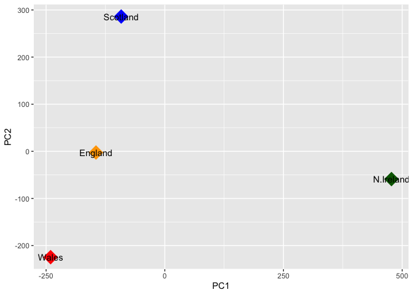

Another major result out of PCA is the so-called “variable loadings” or
`$rotation`. It tells us how the original variables (foods) contribute
to the PCs to the new axis.

``` r
## Lets focus on PC1 as it accounts for > 90% of variance 
ggplot(pca$rotation) +
  aes(x = PC1, 
      y = reorder(rownames(pca$rotation), PC1)) +
  geom_col(fill = "steelblue") +
  xlab("PC1 Loading Score") +
  ylab("") +
  theme_bw() +
  theme(axis.text.y = element_text(size = 9))
```


> Q9: Generate a similar ‘loadings plot’ for PC2. What two food groups
> feature prominantely and what does PC2 maninly tell us about?

``` r
## Lets focus on PC1 as it accounts for > 90% of variance 
ggplot(pca$rotation) +
  aes(x = PC2, 
      y = reorder(rownames(pca$rotation), PC2)) +
  geom_col(fill = "royalblue") +
  xlab("PC2 Loading Score") +
  ylab("") +
  theme_bw() +
  theme(axis.text.y = element_text(size = 9))
```

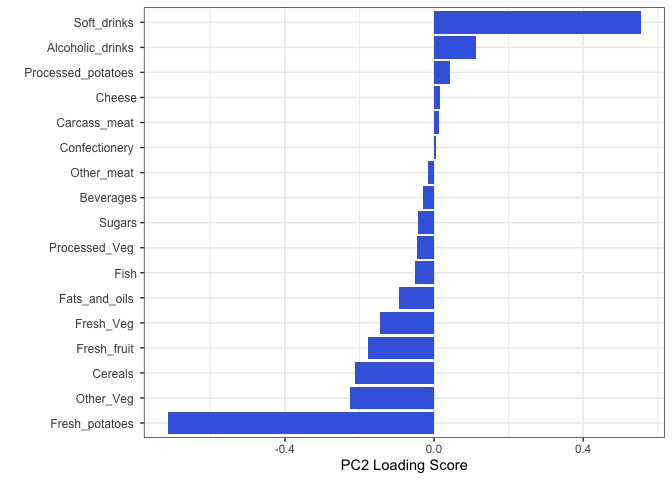
