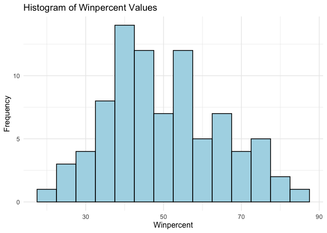
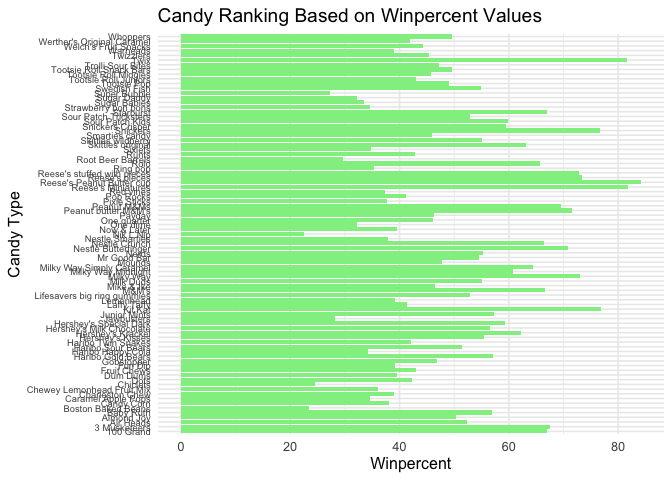
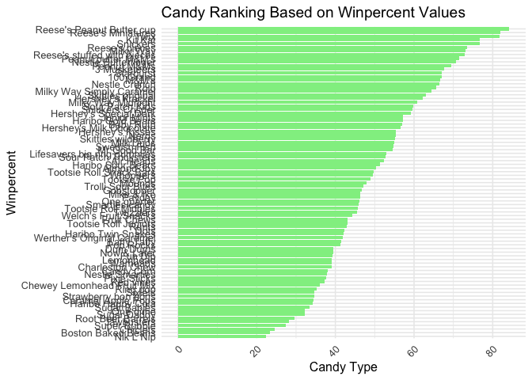
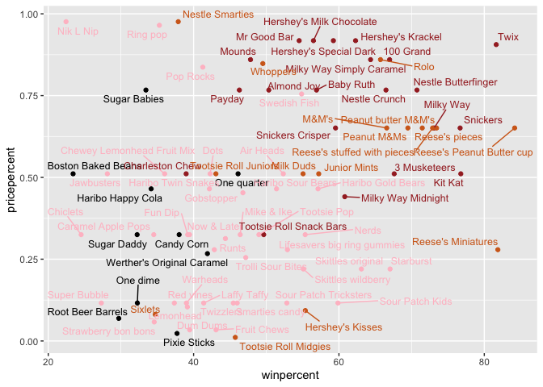
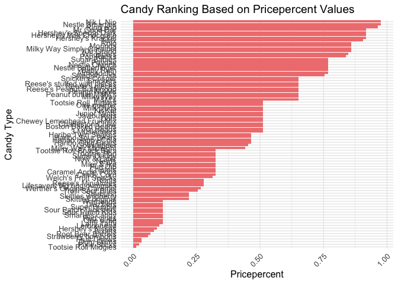
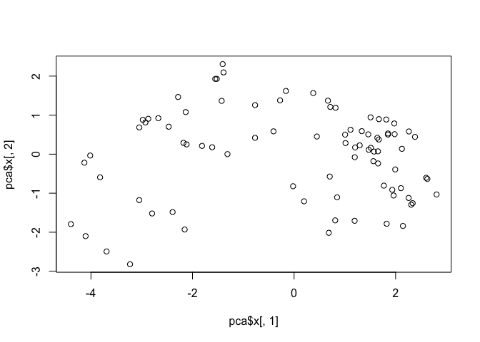
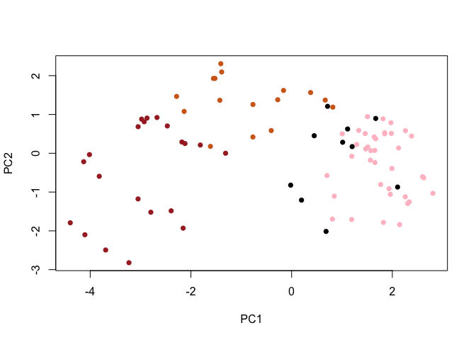
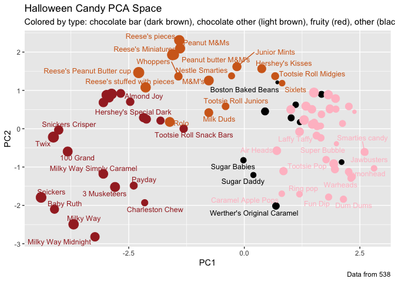
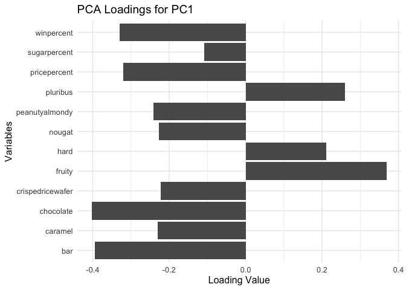

# Class 10: Halloween Project
Henry(A16354124)

## Read document

``` r
candy <- read.csv("https://raw.githubusercontent.com/fivethirtyeight/data/master/candy-power-ranking/candy-data.csv", row.names = 1)
head(candy)
```

                 chocolate fruity caramel peanutyalmondy nougat crispedricewafer
    100 Grand            1      0       1              0      0                1
    3 Musketeers         1      0       0              0      1                0
    One dime             0      0       0              0      0                0
    One quarter          0      0       0              0      0                0
    Air Heads            0      1       0              0      0                0
    Almond Joy           1      0       0              1      0                0
                 hard bar pluribus sugarpercent pricepercent winpercent
    100 Grand       0   1        0        0.732        0.860   66.97173
    3 Musketeers    0   1        0        0.604        0.511   67.60294
    One dime        0   0        0        0.011        0.116   32.26109
    One quarter     0   0        0        0.011        0.511   46.11650
    Air Heads       0   0        0        0.906        0.511   52.34146
    Almond Joy      0   1        0        0.465        0.767   50.34755

``` r
flextable::flextable(head(candy))
```


``` r
library(dplyr)
```


    Attaching package: 'dplyr'

    The following objects are masked from 'package:stats':

        filter, lag

    The following objects are masked from 'package:base':

        intersect, setdiff, setequal, union

``` r
candy %>% select(winpercent)
```

                                winpercent
    100 Grand                     66.97173
    3 Musketeers                  67.60294
    One dime                      32.26109
    One quarter                   46.11650
    Air Heads                     52.34146
    Almond Joy                    50.34755
    Baby Ruth                     56.91455
    Boston Baked Beans            23.41782
    Candy Corn                    38.01096
    Caramel Apple Pops            34.51768
    Charleston Chew               38.97504
    Chewey Lemonhead Fruit Mix    36.01763
    Chiclets                      24.52499
    Dots                          42.27208
    Dum Dums                      39.46056
    Fruit Chews                   43.08892
    Fun Dip                       39.18550
    Gobstopper                    46.78335
    Haribo Gold Bears             57.11974
    Haribo Happy Cola             34.15896
    Haribo Sour Bears             51.41243
    Haribo Twin Snakes            42.17877
    Hershey's Kisses              55.37545
    Hershey's Krackel             62.28448
    Hershey's Milk Chocolate      56.49050
    Hershey's Special Dark        59.23612
    Jawbusters                    28.12744
    Junior Mints                  57.21925
    Kit Kat                       76.76860
    Laffy Taffy                   41.38956
    Lemonhead                     39.14106
    Lifesavers big ring gummies   52.91139
    Peanut butter M&M's           71.46505
    M&M's                         66.57458
    Mike & Ike                    46.41172
    Milk Duds                     55.06407
    Milky Way                     73.09956
    Milky Way Midnight            60.80070
    Milky Way Simply Caramel      64.35334
    Mounds                        47.82975
    Mr Good Bar                   54.52645
    Nerds                         55.35405
    Nestle Butterfinger           70.73564
    Nestle Crunch                 66.47068
    Nik L Nip                     22.44534
    Now & Later                   39.44680
    Payday                        46.29660
    Peanut M&Ms                   69.48379
    Pixie Sticks                  37.72234
    Pop Rocks                     41.26551
    Red vines                     37.34852
    Reese's Miniatures            81.86626
    Reese's Peanut Butter cup     84.18029
    Reese's pieces                73.43499
    Reese's stuffed with pieces   72.88790
    Ring pop                      35.29076
    Rolo                          65.71629
    Root Beer Barrels             29.70369
    Runts                         42.84914
    Sixlets                       34.72200
    Skittles original             63.08514
    Skittles wildberry            55.10370
    Nestle Smarties               37.88719
    Smarties candy                45.99583
    Snickers                      76.67378
    Snickers Crisper              59.52925
    Sour Patch Kids               59.86400
    Sour Patch Tricksters         52.82595
    Starburst                     67.03763
    Strawberry bon bons           34.57899
    Sugar Babies                  33.43755
    Sugar Daddy                   32.23100
    Super Bubble                  27.30386
    Swedish Fish                  54.86111
    Tootsie Pop                   48.98265
    Tootsie Roll Juniors          43.06890
    Tootsie Roll Midgies          45.73675
    Tootsie Roll Snack Bars       49.65350
    Trolli Sour Bites             47.17323
    Twix                          81.64291
    Twizzlers                     45.46628
    Warheads                      39.01190
    Welch's Fruit Snacks          44.37552
    Werther's Original Caramel    41.90431
    Whoppers                      49.52411

``` r
candy |> select(winpercent)
```

                                winpercent
    100 Grand                     66.97173
    3 Musketeers                  67.60294
    One dime                      32.26109
    One quarter                   46.11650
    Air Heads                     52.34146
    Almond Joy                    50.34755
    Baby Ruth                     56.91455
    Boston Baked Beans            23.41782
    Candy Corn                    38.01096
    Caramel Apple Pops            34.51768
    Charleston Chew               38.97504
    Chewey Lemonhead Fruit Mix    36.01763
    Chiclets                      24.52499
    Dots                          42.27208
    Dum Dums                      39.46056
    Fruit Chews                   43.08892
    Fun Dip                       39.18550
    Gobstopper                    46.78335
    Haribo Gold Bears             57.11974
    Haribo Happy Cola             34.15896
    Haribo Sour Bears             51.41243
    Haribo Twin Snakes            42.17877
    Hershey's Kisses              55.37545
    Hershey's Krackel             62.28448
    Hershey's Milk Chocolate      56.49050
    Hershey's Special Dark        59.23612
    Jawbusters                    28.12744
    Junior Mints                  57.21925
    Kit Kat                       76.76860
    Laffy Taffy                   41.38956
    Lemonhead                     39.14106
    Lifesavers big ring gummies   52.91139
    Peanut butter M&M's           71.46505
    M&M's                         66.57458
    Mike & Ike                    46.41172
    Milk Duds                     55.06407
    Milky Way                     73.09956
    Milky Way Midnight            60.80070
    Milky Way Simply Caramel      64.35334
    Mounds                        47.82975
    Mr Good Bar                   54.52645
    Nerds                         55.35405
    Nestle Butterfinger           70.73564
    Nestle Crunch                 66.47068
    Nik L Nip                     22.44534
    Now & Later                   39.44680
    Payday                        46.29660
    Peanut M&Ms                   69.48379
    Pixie Sticks                  37.72234
    Pop Rocks                     41.26551
    Red vines                     37.34852
    Reese's Miniatures            81.86626
    Reese's Peanut Butter cup     84.18029
    Reese's pieces                73.43499
    Reese's stuffed with pieces   72.88790
    Ring pop                      35.29076
    Rolo                          65.71629
    Root Beer Barrels             29.70369
    Runts                         42.84914
    Sixlets                       34.72200
    Skittles original             63.08514
    Skittles wildberry            55.10370
    Nestle Smarties               37.88719
    Smarties candy                45.99583
    Snickers                      76.67378
    Snickers Crisper              59.52925
    Sour Patch Kids               59.86400
    Sour Patch Tricksters         52.82595
    Starburst                     67.03763
    Strawberry bon bons           34.57899
    Sugar Babies                  33.43755
    Sugar Daddy                   32.23100
    Super Bubble                  27.30386
    Swedish Fish                  54.86111
    Tootsie Pop                   48.98265
    Tootsie Roll Juniors          43.06890
    Tootsie Roll Midgies          45.73675
    Tootsie Roll Snack Bars       49.65350
    Trolli Sour Bites             47.17323
    Twix                          81.64291
    Twizzlers                     45.46628
    Warheads                      39.01190
    Welch's Fruit Snacks          44.37552
    Werther's Original Caramel    41.90431
    Whoppers                      49.52411

## Questions

> Q1. How many different candy types are in this dataset?

``` r
nrow(candy)
```

    [1] 85

``` r
candy |> nrow()
```

    [1] 85

> Q2. How many fruity candy types are in the dataset?

``` r
nrow(subset(candy, candy$fruity == 1))
```

    [1] 38

> Q3. What is your favorite candy in the dataset and what is it’s
> winpercent value?

``` r
# Definitely Eminem (M&M's)
candy["M&M's", "winpercent"]
```

    [1] 66.57458

> Q4. What is the winpercent value for “Kit Kat”?

``` r
candy["Kit Kat", "winpercent"]
```

    [1] 76.7686

> Q5. What is the winpercent value for “Tootsie Roll Snack Bars”?

``` r
candy["Tootsie Roll Snack Bars", "winpercent"]
```

    [1] 49.6535

## The package “skimr”

``` r
library("skimr")
skim(candy)
```

|                                                  |       |
|:-------------------------------------------------|:------|
| Name                                             | candy |
| Number of rows                                   | 85    |
| Number of columns                                | 12    |
| \_\_\_\_\_\_\_\_\_\_\_\_\_\_\_\_\_\_\_\_\_\_\_   |       |
| Column type frequency:                           |       |
| numeric                                          | 12    |
| \_\_\_\_\_\_\_\_\_\_\_\_\_\_\_\_\_\_\_\_\_\_\_\_ |       |
| Group variables                                  | None  |

Data summary

**Variable type: numeric**

| skim_variable | n_missing | complete_rate | mean | sd | p0 | p25 | p50 | p75 | p100 | hist |
|:---|---:|---:|---:|---:|---:|---:|---:|---:|---:|:---|
| chocolate | 0 | 1 | 0.44 | 0.50 | 0.00 | 0.00 | 0.00 | 1.00 | 1.00 | ▇▁▁▁▆ |
| fruity | 0 | 1 | 0.45 | 0.50 | 0.00 | 0.00 | 0.00 | 1.00 | 1.00 | ▇▁▁▁▆ |
| caramel | 0 | 1 | 0.16 | 0.37 | 0.00 | 0.00 | 0.00 | 0.00 | 1.00 | ▇▁▁▁▂ |
| peanutyalmondy | 0 | 1 | 0.16 | 0.37 | 0.00 | 0.00 | 0.00 | 0.00 | 1.00 | ▇▁▁▁▂ |
| nougat | 0 | 1 | 0.08 | 0.28 | 0.00 | 0.00 | 0.00 | 0.00 | 1.00 | ▇▁▁▁▁ |
| crispedricewafer | 0 | 1 | 0.08 | 0.28 | 0.00 | 0.00 | 0.00 | 0.00 | 1.00 | ▇▁▁▁▁ |
| hard | 0 | 1 | 0.18 | 0.38 | 0.00 | 0.00 | 0.00 | 0.00 | 1.00 | ▇▁▁▁▂ |
| bar | 0 | 1 | 0.25 | 0.43 | 0.00 | 0.00 | 0.00 | 0.00 | 1.00 | ▇▁▁▁▂ |
| pluribus | 0 | 1 | 0.52 | 0.50 | 0.00 | 0.00 | 1.00 | 1.00 | 1.00 | ▇▁▁▁▇ |
| sugarpercent | 0 | 1 | 0.48 | 0.28 | 0.01 | 0.22 | 0.47 | 0.73 | 0.99 | ▇▇▇▇▆ |
| pricepercent | 0 | 1 | 0.47 | 0.29 | 0.01 | 0.26 | 0.47 | 0.65 | 0.98 | ▇▇▇▇▆ |
| winpercent | 0 | 1 | 50.32 | 14.71 | 22.45 | 39.14 | 47.83 | 59.86 | 84.18 | ▃▇▆▅▂ |

> Q6. Is there any variable/column that looks to be on a different scale
> to the majority of the other columns in the dataset?

Yes, the variable “winpercent” is on a different scale compared to the
other columns.

> Q7. What do you think a zero and one represent for the
> candy\$chocolate column?

A zero represents that the candy does not contain chocolate, while a one
indicates that the candy does contain chocolate.

> Q8. Plot a histogram of winpercent values

``` r
library(ggplot2)
```

    Warning: package 'ggplot2' was built under R version 4.5.2

``` r
ggplot(candy) +
  aes(winpercent) +
  geom_histogram(binwidth = 5, fill = "lightblue", color = "black") +
  labs(title = "Histogram of Winpercent Values", x = "Winpercent", y = "Frequency") +
  theme_minimal(base_size = 12)
```



> Q9. Is the distribution of winpercent values symmetrical?

``` r
ggplot(candy) +
  aes(winpercent) +
  geom_density()
```


No, the distribution of winpercent values is not symmetrical; it appears
to be left-skewed.

> Q10. Is the center of the distribution above or below 50%?

``` r
median(candy$winpercent) >= 50
```

    [1] FALSE

``` r
mean(candy$winpercent) >= 50
```

    [1] TRUE

``` r
summary(candy$winpercent)
```

       Min. 1st Qu.  Median    Mean 3rd Qu.    Max. 
      22.45   39.14   47.83   50.32   59.86   84.18 

> Q11. On average is chocolate candy higher or lower ranked than fruit
> candy?

``` r
mean(candy$winpercent[candy$chocolate == 1]) > mean(candy$winpercent[candy$fruity == 1])
```

    [1] TRUE

``` r
# 1.  Find all chocolate candy in the dataset
# 2. Extract their `winpercent` values
# 3. Find the mean of these values

# 4-6: Do the same for fruity candy
# 7. Which mean value is higher

mean_choc <- candy |> filter(chocolate == 1) |> summarise(mean_winpercent = mean(winpercent))
mean_fruity <- candy |> filter(fruity == 1) |> summarise(mean_winpercent = mean(winpercent))
mean_choc$mean_winpercent > mean_fruity$mean_winpercent
```

    [1] TRUE

``` r
choc.inds <- as.logical(candy$chocolate)
choc.candy <- candy[choc.inds, ]
choc.win <- choc.candy$winpercent
choc.mean <- mean(choc.win)

fruit.inds <- as.logical(candy$fruity)
fruit.candy <- candy[fruit.inds, ]
fruit.win <- fruit.candy$winpercent
fruit.mean <- mean(fruit.win)

choc.mean > fruit.mean
```

    [1] TRUE

> Q12. Is this difference statistically significant?

``` r
t.test(candy$winpercent[candy$chocolate == 1], candy$winpercent[candy$fruity == 1])
```


        Welch Two Sample t-test

    data:  candy$winpercent[candy$chocolate == 1] and candy$winpercent[candy$fruity == 1]
    t = 6.2582, df = 68.882, p-value = 2.871e-08
    alternative hypothesis: true difference in means is not equal to 0
    95 percent confidence interval:
     11.44563 22.15795
    sample estimates:
    mean of x mean of y 
     60.92153  44.11974 

Yes, they are statistically significantly different.

> Q13. What are the five least liked candy types in this set?

``` r
candy[order(candy$winpercent), ][1:5, ]
```

                       chocolate fruity caramel peanutyalmondy nougat
    Nik L Nip                  0      1       0              0      0
    Boston Baked Beans         0      0       0              1      0
    Chiclets                   0      1       0              0      0
    Super Bubble               0      1       0              0      0
    Jawbusters                 0      1       0              0      0
                       crispedricewafer hard bar pluribus sugarpercent pricepercent
    Nik L Nip                         0    0   0        1        0.197        0.976
    Boston Baked Beans                0    0   0        1        0.313        0.511
    Chiclets                          0    0   0        1        0.046        0.325
    Super Bubble                      0    0   0        0        0.162        0.116
    Jawbusters                        0    1   0        1        0.093        0.511
                       winpercent
    Nik L Nip            22.44534
    Boston Baked Beans   23.41782
    Chiclets             24.52499
    Super Bubble         27.30386
    Jawbusters           28.12744

> Q14. What are the top 5 all time favorite candy types out of this set?

``` r
head(candy[order(-candy$winpercent), ], 5)
```

                              chocolate fruity caramel peanutyalmondy nougat
    Reese's Peanut Butter cup         1      0       0              1      0
    Reese's Miniatures                1      0       0              1      0
    Twix                              1      0       1              0      0
    Kit Kat                           1      0       0              0      0
    Snickers                          1      0       1              1      1
                              crispedricewafer hard bar pluribus sugarpercent
    Reese's Peanut Butter cup                0    0   0        0        0.720
    Reese's Miniatures                       0    0   0        0        0.034
    Twix                                     1    0   1        0        0.546
    Kit Kat                                  1    0   1        0        0.313
    Snickers                                 0    0   1        0        0.546
                              pricepercent winpercent
    Reese's Peanut Butter cup        0.651   84.18029
    Reese's Miniatures               0.279   81.86626
    Twix                             0.906   81.64291
    Kit Kat                          0.511   76.76860
    Snickers                         0.651   76.67378

> Q15. Make a first barplot of candy ranking based on winpercent values.

``` r
ggplot(candy) + 
  aes(winpercent, rownames(candy)) +
  geom_col(fill = "lightgreen") +
  labs(title = "Candy Ranking Based on Winpercent Values", x = "Winpercent", y = "Candy Type") +
  theme_minimal(base_size = 12) +
  theme(axis.text.y = element_text(size = 7))
```



> Q16. This is quite ugly, use the reorder() function to get the bars
> sorted by winpercent?

``` r
ggplot(candy) + 
  aes(winpercent, reorder(rownames(candy), winpercent)) +
  geom_col(fill = "lightgreen") +
  labs(title = "Candy Ranking Based on Winpercent Values", x = "Candy Type", y = "Winpercent") +
  theme_minimal(base_size = 12) +
  theme(axis.text.x = element_text(angle = 45, hjust = 1))
```



## Color mapping of histograms

``` r
my_cols=rep("black", nrow(candy))
my_cols[as.logical(candy$chocolate)] = "chocolate"
my_cols[as.logical(candy$bar)] = "brown"
my_cols[as.logical(candy$fruity)] = "pink"

ggplot(candy) + 
  aes(winpercent, reorder(rownames(candy),winpercent)) +
  geom_col(fill=my_cols) 
```


> Q17. What is the worst ranked chocolate candy?

``` r
candy_chocolate <- subset(candy, candy$chocolate == 1)
candy_chocolate[order(candy_chocolate$winpercent), ][1, ]
```

            chocolate fruity caramel peanutyalmondy nougat crispedricewafer hard
    Sixlets         1      0       0              0      0                0    0
            bar pluribus sugarpercent pricepercent winpercent
    Sixlets   0        1         0.22        0.081     34.722

> Q18. What is the best ranked fruity candy?

``` r
candy_fruity <- candy |> filter(fruity == 1) |> arrange(desc(winpercent)) |> slice(1)
candy_fruity
```

              chocolate fruity caramel peanutyalmondy nougat crispedricewafer hard
    Starburst         0      1       0              0      0                0    0
              bar pluribus sugarpercent pricepercent winpercent
    Starburst   0        1        0.151         0.22   67.03763

## Price percents

``` r
library(ggrepel)

# How about a plot of price vs win
ggplot(candy) +
  aes(winpercent, pricepercent, label=rownames(candy)) +
  geom_point(col=my_cols) + 
  geom_text_repel(col=my_cols, size=3.3, max.overlaps = 15)
```

    Warning: ggrepel: 1 unlabeled data points (too many overlaps). Consider
    increasing max.overlaps



> Q19. Which candy type is the highest ranked in terms of winpercent for
> the least money - i.e. offers the most bang for your buck?

``` r
candy_bang_for_buck <- candy %>%
  mutate(bang_for_buck = winpercent / pricepercent) %>%
  arrange(desc(bang_for_buck)) %>%
  slice(1)
candy_bang_for_buck
```

                         chocolate fruity caramel peanutyalmondy nougat
    Tootsie Roll Midgies         1      0       0              0      0
                         crispedricewafer hard bar pluribus sugarpercent
    Tootsie Roll Midgies                0    0   0        1        0.174
                         pricepercent winpercent bang_for_buck
    Tootsie Roll Midgies        0.011   45.73675      4157.886

> Q20. What are the top 5 most expensive candy types in the dataset and
> of these which is the least popular?

``` r
candy_expensive <- candy %>%
  arrange(desc(pricepercent)) %>%
  slice(1:5)
candy_expensive
```

                             chocolate fruity caramel peanutyalmondy nougat
    Nik L Nip                        0      1       0              0      0
    Nestle Smarties                  1      0       0              0      0
    Ring pop                         0      1       0              0      0
    Hershey's Krackel                1      0       0              0      0
    Hershey's Milk Chocolate         1      0       0              0      0
                             crispedricewafer hard bar pluribus sugarpercent
    Nik L Nip                               0    0   0        1        0.197
    Nestle Smarties                         0    0   0        1        0.267
    Ring pop                                0    1   0        0        0.732
    Hershey's Krackel                       1    0   1        0        0.430
    Hershey's Milk Chocolate                0    0   1        0        0.430
                             pricepercent winpercent
    Nik L Nip                       0.976   22.44534
    Nestle Smarties                 0.976   37.88719
    Ring pop                        0.965   35.29076
    Hershey's Krackel               0.918   62.28448
    Hershey's Milk Chocolate        0.918   56.49050

``` r
least_popular_expensive <- candy_expensive %>%
  arrange(winpercent) %>%
  slice(1)
least_popular_expensive # Nik L Nip
```

              chocolate fruity caramel peanutyalmondy nougat crispedricewafer hard
    Nik L Nip         0      1       0              0      0                0    0
              bar pluribus sugarpercent pricepercent winpercent
    Nik L Nip   0        1        0.197        0.976   22.44534

## Optional

> Q21. Make a barplot again with geom_col() this time using pricepercent
> and then improve this step by step, first ordering the x-axis by value
> and finally making a so called “dot chat” or “lollipop” chart by
> swapping geom_col() for geom_point() + geom_segment().

``` r
ggplot(candy) +
  aes(pricepercent, reorder(rownames(candy), pricepercent)) +
  geom_col(fill = "lightcoral") +
  labs(title = "Candy Ranking Based on Pricepercent Values", x = "Pricepercent", y = "Candy Type") +
  theme_minimal(base_size = 12) +
  theme(axis.text.x = element_text(angle = 45, hjust = 1))
```



Lollipop Chart

``` r
# Make a lollipop chart of pricepercent
ggplot(candy) +
  aes(pricepercent, reorder(rownames(candy), pricepercent)) +
  geom_segment(aes(yend = reorder(rownames(candy), pricepercent), 
                   xend = 0), col="gray40") +
    geom_point()
```


## Correlation Structures

``` r
cor(candy)
```

                      chocolate      fruity     caramel peanutyalmondy      nougat
    chocolate         1.0000000 -0.74172106  0.24987535     0.37782357  0.25489183
    fruity           -0.7417211  1.00000000 -0.33548538    -0.39928014 -0.26936712
    caramel           0.2498753 -0.33548538  1.00000000     0.05935614  0.32849280
    peanutyalmondy    0.3778236 -0.39928014  0.05935614     1.00000000  0.21311310
    nougat            0.2548918 -0.26936712  0.32849280     0.21311310  1.00000000
    crispedricewafer  0.3412098 -0.26936712  0.21311310    -0.01764631 -0.08974359
    hard             -0.3441769  0.39067750 -0.12235513    -0.20555661 -0.13867505
    bar               0.5974211 -0.51506558  0.33396002     0.26041960  0.52297636
    pluribus         -0.3396752  0.29972522 -0.26958501    -0.20610932 -0.31033884
    sugarpercent      0.1041691 -0.03439296  0.22193335     0.08788927  0.12308135
    pricepercent      0.5046754 -0.43096853  0.25432709     0.30915323  0.15319643
    winpercent        0.6365167 -0.38093814  0.21341630     0.40619220  0.19937530
                     crispedricewafer        hard         bar    pluribus
    chocolate              0.34120978 -0.34417691  0.59742114 -0.33967519
    fruity                -0.26936712  0.39067750 -0.51506558  0.29972522
    caramel                0.21311310 -0.12235513  0.33396002 -0.26958501
    peanutyalmondy        -0.01764631 -0.20555661  0.26041960 -0.20610932
    nougat                -0.08974359 -0.13867505  0.52297636 -0.31033884
    crispedricewafer       1.00000000 -0.13867505  0.42375093 -0.22469338
    hard                  -0.13867505  1.00000000 -0.26516504  0.01453172
    bar                    0.42375093 -0.26516504  1.00000000 -0.59340892
    pluribus              -0.22469338  0.01453172 -0.59340892  1.00000000
    sugarpercent           0.06994969  0.09180975  0.09998516  0.04552282
    pricepercent           0.32826539 -0.24436534  0.51840654 -0.22079363
    winpercent             0.32467965 -0.31038158  0.42992933 -0.24744787
                     sugarpercent pricepercent winpercent
    chocolate          0.10416906    0.5046754  0.6365167
    fruity            -0.03439296   -0.4309685 -0.3809381
    caramel            0.22193335    0.2543271  0.2134163
    peanutyalmondy     0.08788927    0.3091532  0.4061922
    nougat             0.12308135    0.1531964  0.1993753
    crispedricewafer   0.06994969    0.3282654  0.3246797
    hard               0.09180975   -0.2443653 -0.3103816
    bar                0.09998516    0.5184065  0.4299293
    pluribus           0.04552282   -0.2207936 -0.2474479
    sugarpercent       1.00000000    0.3297064  0.2291507
    pricepercent       0.32970639    1.0000000  0.3453254
    winpercent         0.22915066    0.3453254  1.0000000

``` r
library(corrplot)
```

    corrplot 0.95 loaded

``` r
cij <- cor(candy)
corrplot(cij)
```


> Q22. Examining this plot what two variables are anti-correlated
> (i.e. have minus values)?

Fruity and chocolate, bar and caramel, pluribus and bar, fruity and bar,
etc.

> Q23. Similarly, what two variables are most positively correlated?

Chocolate and bar, bar and nougat, etc.

## PCA

Apply PCA using the prcom() function to our candy dataset remembering to
set the scale=TRUE argument.

``` r
pca <- prcomp(candy, scale = TRUE)
summary(pca)
```

    Importance of components:
                              PC1    PC2    PC3     PC4    PC5     PC6     PC7
    Standard deviation     2.0788 1.1378 1.1092 1.07533 0.9518 0.81923 0.81530
    Proportion of Variance 0.3601 0.1079 0.1025 0.09636 0.0755 0.05593 0.05539
    Cumulative Proportion  0.3601 0.4680 0.5705 0.66688 0.7424 0.79830 0.85369
                               PC8     PC9    PC10    PC11    PC12
    Standard deviation     0.74530 0.67824 0.62349 0.43974 0.39760
    Proportion of Variance 0.04629 0.03833 0.03239 0.01611 0.01317
    Cumulative Proportion  0.89998 0.93832 0.97071 0.98683 1.00000

Now we can plot our main PCA score plot of PC1 vs PC2.

``` r
plot(pca$x[,1], pca$x[,2])
```



We can change the plotting character and add some color:

``` r
plot(pca$x[,1:2], col=my_cols, pch=16)
```



We can make a much nicer plot with the ggplot2 package but it is
important to note that ggplot works best when you supply an input
data.frame that includes a separate column for each of the aesthetics
you would like displayed in your final plot. To accomplish this we make
a new data.frame here that contains our PCA results with all the rest of
our candy data. We will then use this for making plots below

``` r
# Make a new data-frame with our PCA results and candy data
my_data <- cbind(candy, pca$x[,1:3])

p <- ggplot(my_data) + 
        aes(x=PC1, y=PC2, 
            size=winpercent/100,  
            text=rownames(my_data),
            label=rownames(my_data)) +
        geom_point(col=my_cols)

p
```


``` r
p + geom_text_repel(size=3.3, col=my_cols, max.overlaps = 7)  + 
  theme(legend.position = "none") +
  labs(title="Halloween Candy PCA Space",
       subtitle="Colored by type: chocolate bar (dark brown), chocolate other (light brown), fruity (red), other (black)",
       caption="Data from 538")
```

    Warning: ggrepel: 39 unlabeled data points (too many overlaps). Consider
    increasing max.overlaps



library(plotly) \# ggplotly() turns a ggplot into an interactive plotly
plot ggplotly(p)

Let’s finish by taking a quick look at PCA our loadings. Do these make
sense to you? Notice the opposite effects of chocolate and fruity and
the similar effects of chocolate and bar (i.e. we already know they are
correlated).

``` r
ggplot(as.data.frame(pca$rotation)) +
  aes(x=rownames(as.data.frame(pca$rotation)), y=PC1) +
  geom_col() +
  coord_flip() +
  labs(title="PCA Loadings for PC1",
       x="Variables",
       y="Loading Value") +
  theme_minimal(base_size = 12)
```



> Q24. What original variables are picked up strongly by PC1 in the
> positive direction? Do these make sense to you?

``` r
# Variables picked up strongly in the positive direction for PC1
pca$rotation[which(pca$rotation[,1] > 0), 1]
```

       fruity      hard  pluribus 
    0.3683883 0.2111587 0.2600041 

Not really, thought fruity should be go along with chewy.
