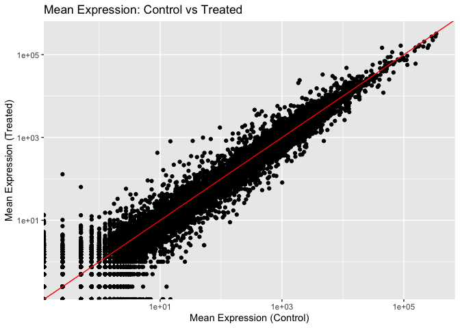
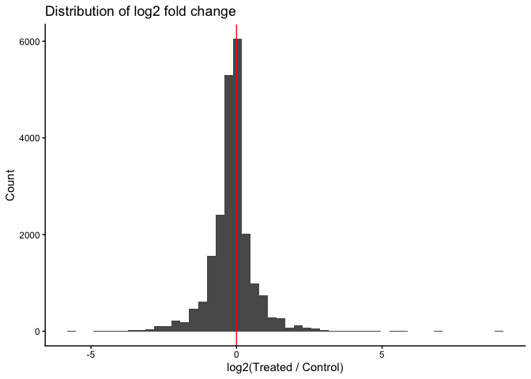
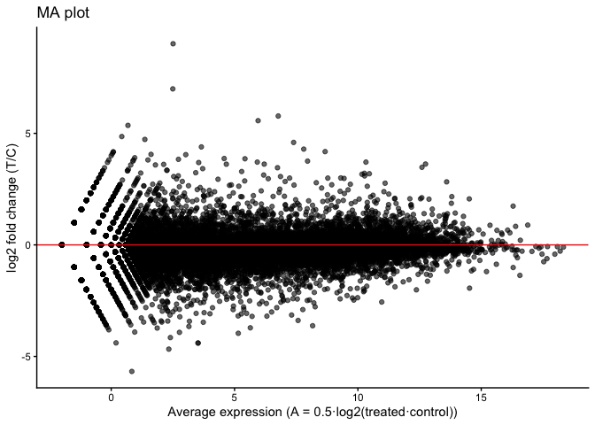
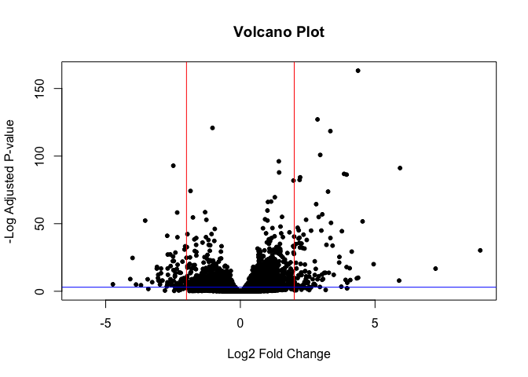
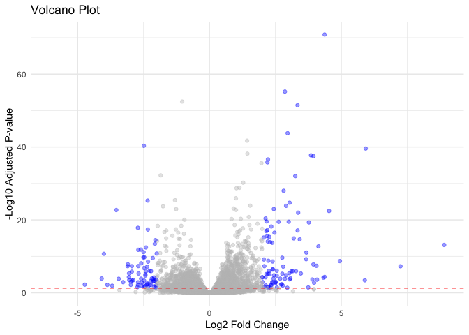

# Class 12: RNASeq with DESeq2
Henry (A16354124)

- [Background](#background)
- [Data Import](#data-import)
- [Dex analysis](#dex-analysis)
  - [1. Extract the “control” column from
    `counts`.](#1-extract-the-control-column-from-counts)
  - [2. Calculate the mean value for each gene in these “control”
    columns.](#2-calculate-the-mean-value-for-each-gene-in-these-control-columns)
  - [3-4. Do the same for the “treated”
    columns.](#3-4-do-the-same-for-the-treated-columns)
  - [5. Compare these mean values for each
    gene.](#5-compare-these-mean-values-for-each-gene)
- [DESeq2 Analysis](#deseq2-analysis)
- [Volcano Plot](#volcano-plot)
- [A nicer ggplot volcano plot](#a-nicer-ggplot-volcano-plot)
- [Save our results](#save-our-results)
- [Add annotation data](#add-annotation-data)

## Background

Today we will analyze some RNASeq data from Himes et al. on the effects
of a common steroid (dexamethasone, also called “dex”) on airway smooth
muscle cells (ASMs).

DESeq2 is a popular R package for analyzing count-based RNA sequencing
data. It provides methods for differential expression analysis based on
the negative binomial distribution.

For this analysis we need two main inputs:

- `countData`: a matrix of raw **counts** where rows are genes and
  columns are samples.
- `colData`: **metadata** a data frame describing the samples (columns)
  in `countData`.

``` r
library(DESeq2, quietly = TRUE)
```

    Warning: package 'DESeq2' was built under R version 4.5.2


    Attaching package: 'generics'

    The following objects are masked from 'package:base':

        as.difftime, as.factor, as.ordered, intersect, is.element, setdiff,
        setequal, union


    Attaching package: 'BiocGenerics'

    The following objects are masked from 'package:stats':

        IQR, mad, sd, var, xtabs

    The following objects are masked from 'package:base':

        anyDuplicated, aperm, append, as.data.frame, basename, cbind,
        colnames, dirname, do.call, duplicated, eval, evalq, Filter, Find,
        get, grep, grepl, is.unsorted, lapply, Map, mapply, match, mget,
        order, paste, pmax, pmax.int, pmin, pmin.int, Position, rank,
        rbind, Reduce, rownames, sapply, saveRDS, table, tapply, unique,
        unsplit, which.max, which.min


    Attaching package: 'S4Vectors'

    The following object is masked from 'package:utils':

        findMatches

    The following objects are masked from 'package:base':

        expand.grid, I, unname


    Attaching package: 'MatrixGenerics'

    The following objects are masked from 'package:matrixStats':

        colAlls, colAnyNAs, colAnys, colAvgsPerRowSet, colCollapse,
        colCounts, colCummaxs, colCummins, colCumprods, colCumsums,
        colDiffs, colIQRDiffs, colIQRs, colLogSumExps, colMadDiffs,
        colMads, colMaxs, colMeans2, colMedians, colMins, colOrderStats,
        colProds, colQuantiles, colRanges, colRanks, colSdDiffs, colSds,
        colSums2, colTabulates, colVarDiffs, colVars, colWeightedMads,
        colWeightedMeans, colWeightedMedians, colWeightedSds,
        colWeightedVars, rowAlls, rowAnyNAs, rowAnys, rowAvgsPerColSet,
        rowCollapse, rowCounts, rowCummaxs, rowCummins, rowCumprods,
        rowCumsums, rowDiffs, rowIQRDiffs, rowIQRs, rowLogSumExps,
        rowMadDiffs, rowMads, rowMaxs, rowMeans2, rowMedians, rowMins,
        rowOrderStats, rowProds, rowQuantiles, rowRanges, rowRanks,
        rowSdDiffs, rowSds, rowSums2, rowTabulates, rowVarDiffs, rowVars,
        rowWeightedMads, rowWeightedMeans, rowWeightedMedians,
        rowWeightedSds, rowWeightedVars

    Welcome to Bioconductor

        Vignettes contain introductory material; view with
        'browseVignettes()'. To cite Bioconductor, see
        'citation("Biobase")', and for packages 'citation("pkgname")'.


    Attaching package: 'Biobase'

    The following object is masked from 'package:MatrixGenerics':

        rowMedians

    The following objects are masked from 'package:matrixStats':

        anyMissing, rowMedians

## Data Import

``` r
counts <- read.csv("airway_scaledcounts.csv", row.names = 1)
metadata <- read.csv("airway_metadata.csv", row.names = 1)
```

Let’s have a wee peak at our `counts` data

``` r
head(counts)
```

                    SRR1039508 SRR1039509 SRR1039512 SRR1039513 SRR1039516
    ENSG00000000003        723        486        904        445       1170
    ENSG00000000005          0          0          0          0          0
    ENSG00000000419        467        523        616        371        582
    ENSG00000000457        347        258        364        237        318
    ENSG00000000460         96         81         73         66        118
    ENSG00000000938          0          0          1          0          2
                    SRR1039517 SRR1039520 SRR1039521
    ENSG00000000003       1097        806        604
    ENSG00000000005          0          0          0
    ENSG00000000419        781        417        509
    ENSG00000000457        447        330        324
    ENSG00000000460         94        102         74
    ENSG00000000938          0          0          0

> Q1. How many “genes” are in this dataset?

``` r
nrow(counts)
```

    [1] 38694

> Q2. How many experiments (i.e. columns in `counts` or rows in
> `metadata`) are there?

``` r
ncol(counts)
```

    [1] 8

> Q3. How many “control” experiments are there in the dataset?

``` r
sum(metadata$dex == "control")
```

    [1] 4

## Dex analysis

### 1. Extract the “control” column from `counts`.

``` r
control.inds <- metadata$dex == "control"
control.counts <- counts[, control.inds]
```

### 2. Calculate the mean value for each gene in these “control” columns.

``` r
head(rowMeans(control.counts))
```

    ENSG00000000003 ENSG00000000005 ENSG00000000419 ENSG00000000457 ENSG00000000460 
             900.75            0.00          520.50          339.75           97.25 
    ENSG00000000938 
               0.75 

### 3-4. Do the same for the “treated” columns.

``` r
treated.inds <- metadata$dex == "treated"
treated.counts <- counts[, treated.inds]
head(rowMeans(treated.counts))
```

    ENSG00000000003 ENSG00000000005 ENSG00000000419 ENSG00000000457 ENSG00000000460 
             658.00            0.00          546.00          316.50           78.75 
    ENSG00000000938 
               0.00 

### 5. Compare these mean values for each gene.

``` r
control.means <- rowMeans(control.counts)
treated.means <- rowMeans(treated.counts)
```

Plot the means

``` r
library(ggplot2)
```

    Warning: package 'ggplot2' was built under R version 4.5.2

``` r
ggplot(data = data.frame(control = control.means, treated = treated.means), aes(x = control, y = treated)) +
  geom_point() +
  geom_abline(slope = 1, intercept = 0, color = "red") +
  labs(title = "Mean Expression: Control vs Treated",
       x = "Mean Expression (Control)",
       y = "Mean Expression (Treated)") +
  scale_x_log10() +
  scale_y_log10()
```

    Warning in scale_x_log10(): log-10 transformation introduced infinite values.

    Warning in scale_y_log10(): log-10 transformation introduced infinite values.



We use log2 “fold-change” as a way to compare.

``` r
# treated/control
# No change
log2(10/10)
```

    [1] 0

``` r
# Doubled, upregulated
log2(20/10)
```

    [1] 1

``` r
# Halved, downregulated
log2(10/20)
```

    [1] -1

``` r
library(dplyr)
```


    Attaching package: 'dplyr'

    The following object is masked from 'package:Biobase':

        combine

    The following object is masked from 'package:matrixStats':

        count

    The following objects are masked from 'package:GenomicRanges':

        intersect, setdiff, union

    The following object is masked from 'package:Seqinfo':

        intersect

    The following objects are masked from 'package:IRanges':

        collapse, desc, intersect, setdiff, slice, union

    The following objects are masked from 'package:S4Vectors':

        first, intersect, rename, setdiff, setequal, union

    The following objects are masked from 'package:BiocGenerics':

        combine, intersect, setdiff, setequal, union

    The following object is masked from 'package:generics':

        explain

    The following objects are masked from 'package:stats':

        filter, lag

    The following objects are masked from 'package:base':

        intersect, setdiff, setequal, union

``` r
library(ggplot2)

# vectors -> data frame
df_raw <- tibble(control = control.means, treated = treated.means)

# 1) sanitize: drop non-finite and zeros (avoids -Inf/NaN)
df <- df_raw %>%
  mutate(across(c(control, treated), ~ as.numeric(.))) %>%
  filter(is.finite(control), is.finite(treated)) %>%
  filter(control > 0, treated > 0)

# 2) compute log2 fold change (LFC) and mean abundance (A) for MA plot
df <- df %>%
  mutate(
    lfc = log2(treated / control),
    A   = 0.5 * log2(treated * control)   # mean on log scale
  )

# 3a) histogram of LFC
ggplot(df, aes(lfc)) +
  geom_histogram(bins = 50) +
  geom_vline(xintercept = 0, color = "red") +
  labs(x = "log2(Treated / Control)", y = "Count",
       title = "Distribution of log2 fold change") +
  theme_classic()
```



``` r
# 3b) MA plot (recommended)
ggplot(df, aes(x = A, y = lfc)) +
  geom_point(alpha = 0.6) +
  geom_hline(yintercept = 0, color = "red") +
  labs(x = "Average expression (A = 0.5·log2(treated·control))",
       y = "log2 fold change (T/C)",
       title = "MA plot") +
  theme_classic()
```



> Q How many genes are “up” regulated at the +2 log2FC threshold?

``` r
sum(df$lfc >= 2)
```

    [1] 314

> Q How many genes are “down” regulated at the -2 log2FC threshold?

``` r
sum(df$lfc <= -2)
```

    [1] 485

## DESeq2 Analysis

DESeq wants 3 things for analysis, countData, colData, and design.

``` r
dds <- DESeqDataSetFromMatrix(countData = counts,
                                      colData = metadata,
                                      design = ~ dex)
```

    converting counts to integer mode

    Warning in DESeqDataSet(se, design = design, ignoreRank): some variables in
    design formula are characters, converting to factors

The main function in the DESeq package to run analysis is called
`DESeq()`.

``` r
dds <- DESeq(dds)
```

    estimating size factors

    estimating dispersions

    gene-wise dispersion estimates

    mean-dispersion relationship

    final dispersion estimates

    fitting model and testing

Get the results out of this DESeq object with the function `results()`.

``` r
res <- results(dds)
head(res)
```

    log2 fold change (MLE): dex treated vs control 
    Wald test p-value: dex treated vs control 
    DataFrame with 6 rows and 6 columns
                      baseMean log2FoldChange     lfcSE      stat    pvalue
                     <numeric>      <numeric> <numeric> <numeric> <numeric>
    ENSG00000000003 747.194195      -0.350703  0.168242 -2.084514 0.0371134
    ENSG00000000005   0.000000             NA        NA        NA        NA
    ENSG00000000419 520.134160       0.206107  0.101042  2.039828 0.0413675
    ENSG00000000457 322.664844       0.024527  0.145134  0.168996 0.8658000
    ENSG00000000460  87.682625      -0.147143  0.256995 -0.572550 0.5669497
    ENSG00000000938   0.319167      -1.732289  3.493601 -0.495846 0.6200029
                         padj
                    <numeric>
    ENSG00000000003  0.163017
    ENSG00000000005        NA
    ENSG00000000419  0.175937
    ENSG00000000457  0.961682
    ENSG00000000460  0.815805
    ENSG00000000938        NA

## Volcano Plot

This is a plot of log2FC vs p-value

``` r
plot(res$log2FoldChange, -log(res$padj), pch=20, main="Volcano Plot",
     xlab="Log2 Fold Change", ylab="-Log Adjusted P-value")

abline(v=c(-2,2), col="red")
abline(h=-log(0.05), col="blue")
```



## A nicer ggplot volcano plot

``` r
library(ggplot2)

mycols <- rep("grey", nrow(res))
mycols[abs(res$log2FoldChange)>2 & res$padj < 0.05] <- "blue"

ggplot(res)+
  aes(x=log2FoldChange, y=-log10(padj))+
  geom_point(alpha=0.4, col = mycols)+
  geom_hline(yintercept=-log10(0.05), col="red", linetype="dashed")+
  labs(title="Volcano Plot",
       x="Log2 Fold Change",
       y="-Log10 Adjusted P-value")+
  theme_minimal()
```

    Warning: Removed 23549 rows containing missing values or values outside the scale range
    (`geom_point()`).



## Save our results

``` r
write.csv(res, file="myresults.csv")
```

## Add annotation data

We need to add gene symbols, gene names and other database ids to make
my results useful for further analysis.

``` r
head(res)
```

    log2 fold change (MLE): dex treated vs control 
    Wald test p-value: dex treated vs control 
    DataFrame with 6 rows and 6 columns
                      baseMean log2FoldChange     lfcSE      stat    pvalue
                     <numeric>      <numeric> <numeric> <numeric> <numeric>
    ENSG00000000003 747.194195      -0.350703  0.168242 -2.084514 0.0371134
    ENSG00000000005   0.000000             NA        NA        NA        NA
    ENSG00000000419 520.134160       0.206107  0.101042  2.039828 0.0413675
    ENSG00000000457 322.664844       0.024527  0.145134  0.168996 0.8658000
    ENSG00000000460  87.682625      -0.147143  0.256995 -0.572550 0.5669497
    ENSG00000000938   0.319167      -1.732289  3.493601 -0.495846 0.6200029
                         padj
                    <numeric>
    ENSG00000000003  0.163017
    ENSG00000000005        NA
    ENSG00000000419  0.175937
    ENSG00000000457  0.961682
    ENSG00000000460  0.815805
    ENSG00000000938        NA

We have ENSEMBLE dadabase ids in our `res` object

``` r
head(rownames(res))
```

    [1] "ENSG00000000003" "ENSG00000000005" "ENSG00000000419" "ENSG00000000457"
    [5] "ENSG00000000460" "ENSG00000000938"

We can use the `mapIDs()` function from bioconductor to help us.

``` r
library("AnnotationDbi")
```


    Attaching package: 'AnnotationDbi'

    The following object is masked from 'package:dplyr':

        select

``` r
library("org.Hs.eg.db")
```

Let’s see what database id formats we can translate between

``` r
columns(org.Hs.eg.db)
```

     [1] "ACCNUM"       "ALIAS"        "ENSEMBL"      "ENSEMBLPROT"  "ENSEMBLTRANS"
     [6] "ENTREZID"     "ENZYME"       "EVIDENCE"     "EVIDENCEALL"  "GENENAME"    
    [11] "GENETYPE"     "GO"           "GOALL"        "IPI"          "MAP"         
    [16] "OMIM"         "ONTOLOGY"     "ONTOLOGYALL"  "PATH"         "PFAM"        
    [21] "PMID"         "PROSITE"      "REFSEQ"       "SYMBOL"       "UCSCKG"      
    [26] "UNIPROT"     

``` r
res$symbol <- mapIds(org.Hs.eg.db,
                     keys=row.names(res), # Our genenames
                     keytype="ENSEMBL",        # The format of our genenames
                     column="SYMBOL",          # The new format we want to add
                     multiVals="first")
```

    'select()' returned 1:many mapping between keys and columns

``` r
head(res$symbol)
```

    ENSG00000000003 ENSG00000000005 ENSG00000000419 ENSG00000000457 ENSG00000000460 
           "TSPAN6"          "TNMD"          "DPM1"         "SCYL3"         "FIRRM" 
    ENSG00000000938 
              "FGR" 

Add `GENENAME`, then `ENTREZID`.

``` r
res$genename <- mapIds(org.Hs.eg.db,
                     keys=row.names(res), # Our genenames
                     keytype="ENSEMBL",        # The format of our genenames
                     column="GENENAME",          # The new format we want to add
                     multiVals="first")
```

    'select()' returned 1:many mapping between keys and columns

``` r
head(res$genename)
```

                                                  ENSG00000000003 
                                                  "tetraspanin 6" 
                                                  ENSG00000000005 
                                                    "tenomodulin" 
                                                  ENSG00000000419 
    "dolichyl-phosphate mannosyltransferase subunit 1, catalytic" 
                                                  ENSG00000000457 
                                       "SCY1 like pseudokinase 3" 
                                                  ENSG00000000460 
      "FIGNL1 interacting regulator of recombination and mitosis" 
                                                  ENSG00000000938 
                 "FGR proto-oncogene, Src family tyrosine kinase" 

``` r
res$entrez <- mapIds(org.Hs.eg.db,
                     keys=row.names(res), # Our genenames
                     keytype="ENSEMBL",        # The format of our genenames
                     column="ENTREZID",          # The new format we want to add
                     multiVals="first")
```

    'select()' returned 1:many mapping between keys and columns

``` r
head(res$entrez)
```

    ENSG00000000003 ENSG00000000005 ENSG00000000419 ENSG00000000457 ENSG00000000460 
             "7105"         "64102"          "8813"         "57147"         "55732" 
    ENSG00000000938 
             "2268" 

\## Save my annotated results

``` r
write.csv(res, file = "myresults_annotated.csv")
```

\## Pathway analysis

We will use the **gage** function from bioconductor.

``` r
library(pathview)
```

    ##############################################################################
    Pathview is an open source software package distributed under GNU General
    Public License version 3 (GPLv3). Details of GPLv3 is available at
    http://www.gnu.org/licenses/gpl-3.0.html. Particullary, users are required to
    formally cite the original Pathview paper (not just mention it) in publications
    or products. For details, do citation("pathview") within R.

    The pathview downloads and uses KEGG data. Non-academic uses may require a KEGG
    license agreement (details at http://www.kegg.jp/kegg/legal.html).
    ##############################################################################

``` r
library(gage)
```

``` r
library(gageData)

data(kegg.sets.hs)

# Examine the first 2 pathways in this kegg set for humans
head(kegg.sets.hs, 2)
```

    $`hsa00232 Caffeine metabolism`
    [1] "10"   "1544" "1548" "1549" "1553" "7498" "9"   

    $`hsa00983 Drug metabolism - other enzymes`
     [1] "10"     "1066"   "10720"  "10941"  "151531" "1548"   "1549"   "1551"  
     [9] "1553"   "1576"   "1577"   "1806"   "1807"   "1890"   "221223" "2990"  
    [17] "3251"   "3614"   "3615"   "3704"   "51733"  "54490"  "54575"  "54576" 
    [25] "54577"  "54578"  "54579"  "54600"  "54657"  "54658"  "54659"  "54963" 
    [33] "574537" "64816"  "7083"   "7084"   "7172"   "7363"   "7364"   "7365"  
    [41] "7366"   "7367"   "7371"   "7372"   "7378"   "7498"   "79799"  "83549" 
    [49] "8824"   "8833"   "9"      "978"   

What `gage` wants as input is a named vector of importance i.e. a vector
with labeled fold-changes.

``` r
x <- c("barry" = 5, "monika" = 10)
x
```

     barry monika 
         5     10 

``` r
names(x)
```

    [1] "barry"  "monika"

``` r
foldchanges <- res$log2FoldChange
names(foldchanges) <- res$entrez
head(foldchanges)
```

           7105       64102        8813       57147       55732        2268 
    -0.35070296          NA  0.20610728  0.02452701 -0.14714263 -1.73228897 

``` r
data(kegg.sets.hs)
keggres = gage(foldchanges, gsets = kegg.sets.hs)
```

What is in the results:

``` r
attributes(keggres)
```

    $names
    [1] "greater" "less"    "stats"  

``` r
head(keggres$less)
```

                                                             p.geomean stat.mean
    hsa05332 Graft-versus-host disease                    0.0004250607 -3.473335
    hsa04940 Type I diabetes mellitus                     0.0017820379 -3.002350
    hsa05310 Asthma                                       0.0020046180 -3.009045
    hsa04672 Intestinal immune network for IgA production 0.0060434609 -2.560546
    hsa05330 Allograft rejection                          0.0073679547 -2.501416
    hsa04340 Hedgehog signaling pathway                   0.0133239837 -2.248546
                                                                 p.val      q.val
    hsa05332 Graft-versus-host disease                    0.0004250607 0.09053792
    hsa04940 Type I diabetes mellitus                     0.0017820379 0.14232788
    hsa05310 Asthma                                       0.0020046180 0.14232788
    hsa04672 Intestinal immune network for IgA production 0.0060434609 0.31387487
    hsa05330 Allograft rejection                          0.0073679547 0.31387487
    hsa04340 Hedgehog signaling pathway                   0.0133239837 0.47300142
                                                          set.size         exp1
    hsa05332 Graft-versus-host disease                          40 0.0004250607
    hsa04940 Type I diabetes mellitus                           42 0.0017820379
    hsa05310 Asthma                                             29 0.0020046180
    hsa04672 Intestinal immune network for IgA production       47 0.0060434609
    hsa05330 Allograft rejection                                36 0.0073679547
    hsa04340 Hedgehog signaling pathway                         56 0.0133239837

``` r
head(keggres$greater)
```

                                              p.geomean stat.mean      p.val
    hsa00500 Starch and sucrose metabolism   0.00330618  2.772653 0.00330618
    hsa00330 Arginine and proline metabolism 0.01524126  2.194146 0.01524126
    hsa04910 Insulin signaling pathway       0.01711093  2.129512 0.01711093
    hsa04510 Focal adhesion                  0.02523991  1.961953 0.02523991
    hsa04920 Adipocytokine signaling pathway 0.04342610  1.725063 0.04342610
    hsa00790 Folate biosynthesis             0.04825453  1.744386 0.04825453
                                                 q.val set.size       exp1
    hsa00500 Starch and sucrose metabolism   0.7042163       52 0.00330618
    hsa00330 Arginine and proline metabolism 0.7774871       53 0.01524126
    hsa04910 Insulin signaling pathway       0.7774871      138 0.01711093
    hsa04510 Focal adhesion                  0.7774871      200 0.02523991
    hsa04920 Adipocytokine signaling pathway 0.7774871       68 0.04342610
    hsa00790 Folate biosynthesis             0.7774871       11 0.04825453

Let’s look at just one of these hsa05310

``` r
library(pathview)

pathview(gene.data = foldchanges, pathway.id = "hsa05310")
```

Insert figure for this pathway:


