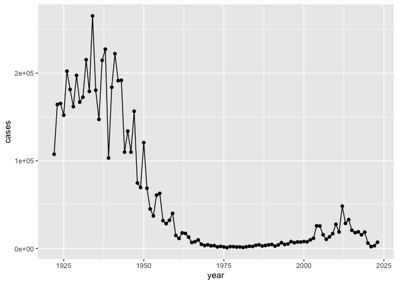
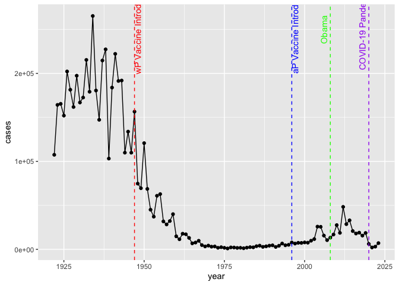
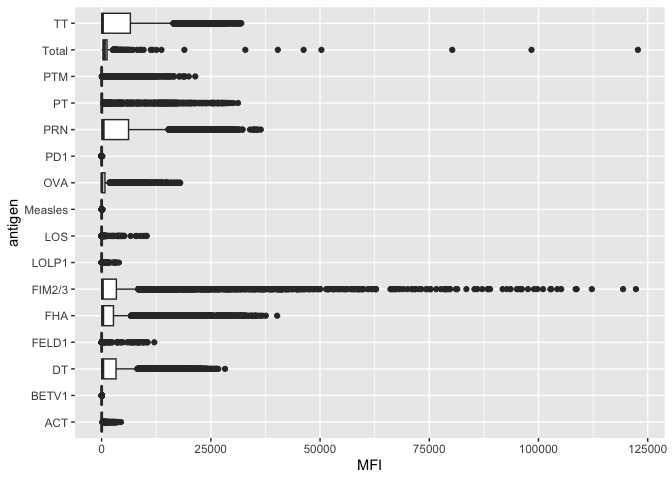
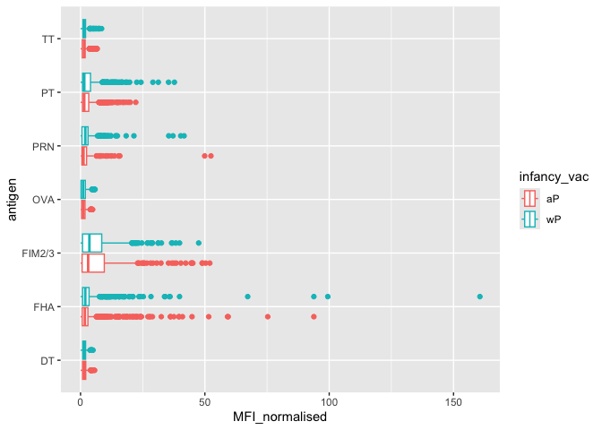
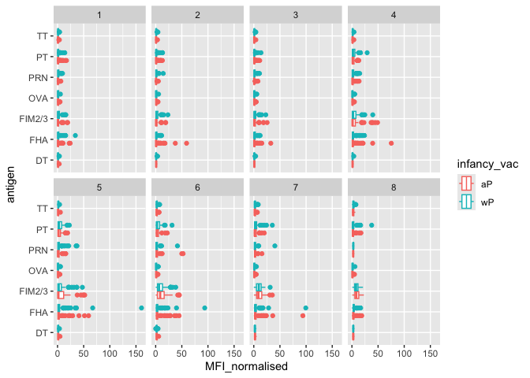
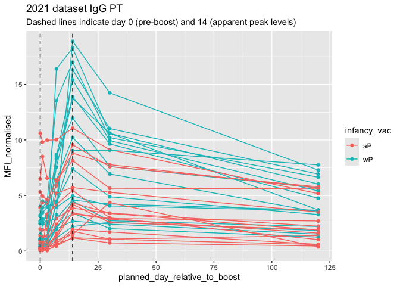

# Class 19: Pertussis Mini Project
Henry (A16354124)

- [Background](#background)
- [The CMI-PB project](#the-cmi-pb-project)
- [Focus in IgG](#focus-in-igg)
  - [Differences between aP and wP?](#differences-between-ap-and-wp)
  - [Time course analysis](#time-course-analysis)
- [Time course of PT](#time-course-of-pt)
- [Session setup](#session-setup)

## Background

Pertussis (a.k.a. Whooping cough) is a highly infectious lung infection
caused by the bacteria *B. Pertussis*.

The CDC tracks case numbers in the U.S. and make it available online.

> Q1. Make a plot of Pertussis cases per year with ggplot

``` r
library(ggplot2)
```

    Warning: package 'ggplot2' was built under R version 4.5.2

``` r
ggplot(cdc)+
         aes(year, cases)+
         geom_point()+
         geom_line()
```



> Q2. Add some annotation (lines on the plot) for some major milestones
> in Pertussis vaccination history. The original wP deployment in 1947
> and the newer aP vaccine roll-out in 1996.

``` r
ggplot(cdc)+
         aes(year, cases)+
         geom_point()+
         geom_line()+
         geom_vline(xintercept = 1947, linetype="dashed", color = "red")+
         geom_vline(xintercept = 1996, linetype="dashed", color = "blue")+
         geom_vline(xintercept = 2008, linetype = "dashed", color = "green")+
         geom_vline(xintercept = 2020, linetype = "dashed", color = "purple")+
         annotate("text", x = 1950, y = 250000, label = "wP Vaccine Introduced", color = "red", angle=90, vjust = -0.5)+
         annotate("text", x = 1999, y = 250000, label = "aP Vaccine Introduced", color = "blue", angle=90, vjust = -0.5)+
         annotate("text", x = 2008, y = 250000, label = "Obama", color = "green", angle=90, vjust = -0.5)+
         annotate("text", x = 2020, y = 250000, label = "COVID-19 Pandemic", color = "purple", angle=90, vjust = -0.5)
```



> Q2.5(Q3 in labsheet). Describe what happened after the introduction of
> the aP vaccine? Do you have a possible explanation for the observed
> trend?

Seems that the problem would go with flus and virus pandemics like H1N1,
SARS, and COVID-19. The aP vaccine was introduced in 1996, and after
that, there was a general decline in pertussis cases. However, there
were spikes in cases around 2004 and 2012, which could be attributed to
various factors such as changes in vaccination rates, waning immunity,
or increased awareness and reporting of the disease. The COVID-19
pandemic in 2020 also likely impacted pertussis case numbers due to
changes in healthcare access and public health measures.

The aP vs wP

## The CMI-PB project

The CMI-Pertussis Boost (PB) project focuses on gathering data on this
very topic. What is distinct between aP and wP individuals over time
when they encounter Percussis again.

They make their data available via a JSON format returning API. We can
read JSON format with the `read_json()` function from the **jsonlite**
package.

``` r
library(jsonlite)
subject <- read_json("https://www.cmi-pb.org/api/v5_1/subject",
                     simplifyVector = TRUE)
head(subject)
```

      subject_id infancy_vac biological_sex              ethnicity  race
    1          1          wP         Female Not Hispanic or Latino White
    2          2          wP         Female Not Hispanic or Latino White
    3          3          wP         Female                Unknown White
    4          4          wP           Male Not Hispanic or Latino Asian
    5          5          wP           Male Not Hispanic or Latino Asian
    6          6          wP         Female Not Hispanic or Latino White
      year_of_birth date_of_boost      dataset
    1    1986-01-01    2016-09-12 2020_dataset
    2    1968-01-01    2019-01-28 2020_dataset
    3    1983-01-01    2016-10-10 2020_dataset
    4    1988-01-01    2016-08-29 2020_dataset
    5    1991-01-01    2016-08-29 2020_dataset
    6    1988-01-01    2016-10-10 2020_dataset

> Q3. How many “subject” (or individuals) are in this dataset?

``` r
table(subject$infancy_vac)
```


    aP wP 
    87 85 

> Q4. How many wP and aP primed subjects are there in the dataset?

``` r
sum(subject$infancy_vac == "wP")
```

    [1] 85

``` r
sum(subject$infancy_vac == "aP")
```

    [1] 87

``` r
table(subject$infancy_vac)
```


    aP wP 
    87 85 

> Q5. What is the `biological_sex` and `race` breakdown of these
> subjects?

``` r
table(subject$race, subject$biological_sex)
```

                                               
                                                Female Male
      American Indian/Alaska Native                  0    1
      Asian                                         32   12
      Black or African American                      2    3
      More Than One Race                            15    4
      Native Hawaiian or Other Pacific Islander      1    1
      Unknown or Not Reported                       14    7
      White                                         48   32

Let’s read more tables from the CMI-PB database API.

``` r
specimen <- read_json("http://cmi-pb.org/api/v5_1/specimen",
                      simplifyVector = TRUE)
ab_titer <- read_json("https://www.cmi-pb.org/api/v5_1/plasma_ab_titer",
                      simplifyVector = TRUE)
```

Join (or link, or merge, or whatever) these two tables together based on
the `specimen_id` column that is present in both tables, using the
`inner_join()` function from **dplyr** package.

``` r
library(dplyr)
```


    Attaching package: 'dplyr'

    The following objects are masked from 'package:stats':

        filter, lag

    The following objects are masked from 'package:base':

        intersect, setdiff, setequal, union

``` r
meta <- inner_join(subject, specimen)
```

    Joining with `by = join_by(subject_id)`

``` r
head(meta)
```

      subject_id infancy_vac biological_sex              ethnicity  race
    1          1          wP         Female Not Hispanic or Latino White
    2          1          wP         Female Not Hispanic or Latino White
    3          1          wP         Female Not Hispanic or Latino White
    4          1          wP         Female Not Hispanic or Latino White
    5          1          wP         Female Not Hispanic or Latino White
    6          1          wP         Female Not Hispanic or Latino White
      year_of_birth date_of_boost      dataset specimen_id
    1    1986-01-01    2016-09-12 2020_dataset           1
    2    1986-01-01    2016-09-12 2020_dataset           2
    3    1986-01-01    2016-09-12 2020_dataset           3
    4    1986-01-01    2016-09-12 2020_dataset           4
    5    1986-01-01    2016-09-12 2020_dataset           5
    6    1986-01-01    2016-09-12 2020_dataset           6
      actual_day_relative_to_boost planned_day_relative_to_boost specimen_type
    1                           -3                             0         Blood
    2                            1                             1         Blood
    3                            3                             3         Blood
    4                            7                             7         Blood
    5                           11                            14         Blood
    6                           32                            30         Blood
      visit
    1     1
    2     2
    3     3
    4     4
    5     5
    6     6

``` r
head(ab_titer)
```

      specimen_id isotype is_antigen_specific antigen        MFI MFI_normalised
    1           1     IgE               FALSE   Total 1110.21154       2.493425
    2           1     IgE               FALSE   Total 2708.91616       2.493425
    3           1     IgG                TRUE      PT   68.56614       3.736992
    4           1     IgG                TRUE     PRN  332.12718       2.602350
    5           1     IgG                TRUE     FHA 1887.12263      34.050956
    6           1     IgE                TRUE     ACT    0.10000       1.000000
       unit lower_limit_of_detection
    1 UG/ML                 2.096133
    2 IU/ML                29.170000
    3 IU/ML                 0.530000
    4 IU/ML                 6.205949
    5 IU/ML                 4.679535
    6 IU/ML                 2.816431

``` r
ab_data <- inner_join(meta, ab_titer)
```

    Joining with `by = join_by(specimen_id)`

``` r
head(ab_data)
```

      subject_id infancy_vac biological_sex              ethnicity  race
    1          1          wP         Female Not Hispanic or Latino White
    2          1          wP         Female Not Hispanic or Latino White
    3          1          wP         Female Not Hispanic or Latino White
    4          1          wP         Female Not Hispanic or Latino White
    5          1          wP         Female Not Hispanic or Latino White
    6          1          wP         Female Not Hispanic or Latino White
      year_of_birth date_of_boost      dataset specimen_id
    1    1986-01-01    2016-09-12 2020_dataset           1
    2    1986-01-01    2016-09-12 2020_dataset           1
    3    1986-01-01    2016-09-12 2020_dataset           1
    4    1986-01-01    2016-09-12 2020_dataset           1
    5    1986-01-01    2016-09-12 2020_dataset           1
    6    1986-01-01    2016-09-12 2020_dataset           1
      actual_day_relative_to_boost planned_day_relative_to_boost specimen_type
    1                           -3                             0         Blood
    2                           -3                             0         Blood
    3                           -3                             0         Blood
    4                           -3                             0         Blood
    5                           -3                             0         Blood
    6                           -3                             0         Blood
      visit isotype is_antigen_specific antigen        MFI MFI_normalised  unit
    1     1     IgE               FALSE   Total 1110.21154       2.493425 UG/ML
    2     1     IgE               FALSE   Total 2708.91616       2.493425 IU/ML
    3     1     IgG                TRUE      PT   68.56614       3.736992 IU/ML
    4     1     IgG                TRUE     PRN  332.12718       2.602350 IU/ML
    5     1     IgG                TRUE     FHA 1887.12263      34.050956 IU/ML
    6     1     IgE                TRUE     ACT    0.10000       1.000000 IU/ML
      lower_limit_of_detection
    1                 2.096133
    2                29.170000
    3                 0.530000
    4                 6.205949
    5                 4.679535
    6                 2.816431

> Q6. How many different Ab isotypes are there?

``` r
unique(ab_data$isotype)
```

    [1] "IgE"  "IgG"  "IgG1" "IgG2" "IgG3" "IgG4"

> Q7. How many different antigens are there in the dataset?

``` r
unique(ab_data$antigen)
```

     [1] "Total"   "PT"      "PRN"     "FHA"     "ACT"     "LOS"     "FELD1"  
     [8] "BETV1"   "LOLP1"   "Measles" "PTM"     "FIM2/3"  "TT"      "DT"     
    [15] "OVA"     "PD1"    

> Q8. Let’s plot antigen MFI levels accross the whole dataset.

``` r
ggplot(ab_data)+
  aes(MFI, antigen)+
  geom_boxplot()
```

    Warning: Removed 1 row containing non-finite outside the scale range
    (`stat_boxplot()`).



## Focus in IgG

IgG is crucial for long-term immunity and responding to bacterial &
viral infections.

``` r
igg <- ab_data |> 
  filter(isotype == "IgG")
```

Plot of antigen levels again but for IgG only

``` r
ggplot(igg) +
  aes(MFI_normalised, antigen) +
  geom_boxplot()
```


### Differences between aP and wP?

We can color up by the `infancy_vac` values of “wP” or “aP”.

``` r
ggplot(igg) +
  aes(MFI_normalised, antigen, col = infancy_vac) +
  geom_boxplot()
```



We can facet by the aP vs wP column.

``` r
ggplot(igg) +
  aes(MFI_normalised, antigen, col = infancy_vac) +
  geom_boxplot() +
  facet_wrap(~infancy_vac)
```


### Time course analysis

``` r
table(ab_data$visit)
```


       1    2    3    4    5    6    7    8    9   10   11   12 
    8280 8280 8420 8420 8420 8100 7700 2670  770  686  105  105 

We can use `visit` as a proxy for time here and facet out plots by this
value 1 to 8 …

``` r
igg |>
  filter(visit %in% 1:8) |>
  ggplot() +
    aes(MFI_normalised, antigen, col = infancy_vac) +
    geom_boxplot() +
    facet_wrap(~visit, nrow = 2)
```



## Time course of PT

``` r
pt <- igg |>
  filter(antigen == "PT") |>
  filter(dataset == "2021_dataset")
```

``` r
ggplot(pt) +
    aes(x=planned_day_relative_to_boost,
        y=MFI_normalised,
        col=infancy_vac,
        group=subject_id) +
    geom_point() +
    geom_line() +
    geom_vline(xintercept=0, linetype="dashed") +
    geom_vline(xintercept=14, linetype="dashed") +
    labs(title="2021 dataset IgG PT",
       subtitle = "Dashed lines indicate day 0 (pre-boost) and 14 (apparent peak levels)")
```



## Session setup

``` r
sessionInfo()
```

    R version 4.5.1 (2025-06-13)
    Platform: aarch64-apple-darwin20
    Running under: macOS Tahoe 26.0.1

    Matrix products: default
    BLAS:   /Library/Frameworks/R.framework/Versions/4.5-arm64/Resources/lib/libRblas.0.dylib 
    LAPACK: /Library/Frameworks/R.framework/Versions/4.5-arm64/Resources/lib/libRlapack.dylib;  LAPACK version 3.12.1

    locale:
    [1] en_US.UTF-8/en_US.UTF-8/en_US.UTF-8/C/en_US.UTF-8/en_US.UTF-8

    time zone: America/Los_Angeles
    tzcode source: internal

    attached base packages:
    [1] stats     graphics  grDevices utils     datasets  methods   base     

    other attached packages:
    [1] dplyr_1.1.4    jsonlite_2.0.0 ggplot2_4.0.1 

    loaded via a namespace (and not attached):
     [1] vctrs_0.6.5        cli_3.6.5          knitr_1.50         rlang_1.1.6       
     [5] xfun_0.54          generics_0.1.4     S7_0.2.1           labeling_0.4.3    
     [9] glue_1.8.0         htmltools_0.5.8.1  scales_1.4.0       rmarkdown_2.30    
    [13] grid_4.5.1         evaluate_1.0.5     tibble_3.3.0       fastmap_1.2.0     
    [17] yaml_2.3.10        lifecycle_1.0.4    compiler_4.5.1     RColorBrewer_1.1-3
    [21] pkgconfig_2.0.3    rstudioapi_0.17.1  farver_2.1.2       digest_0.6.38     
    [25] R6_2.6.1           tidyselect_1.2.1   pillar_1.11.1      magrittr_2.0.4    
    [29] withr_3.0.2        tools_4.5.1        gtable_0.3.6      
